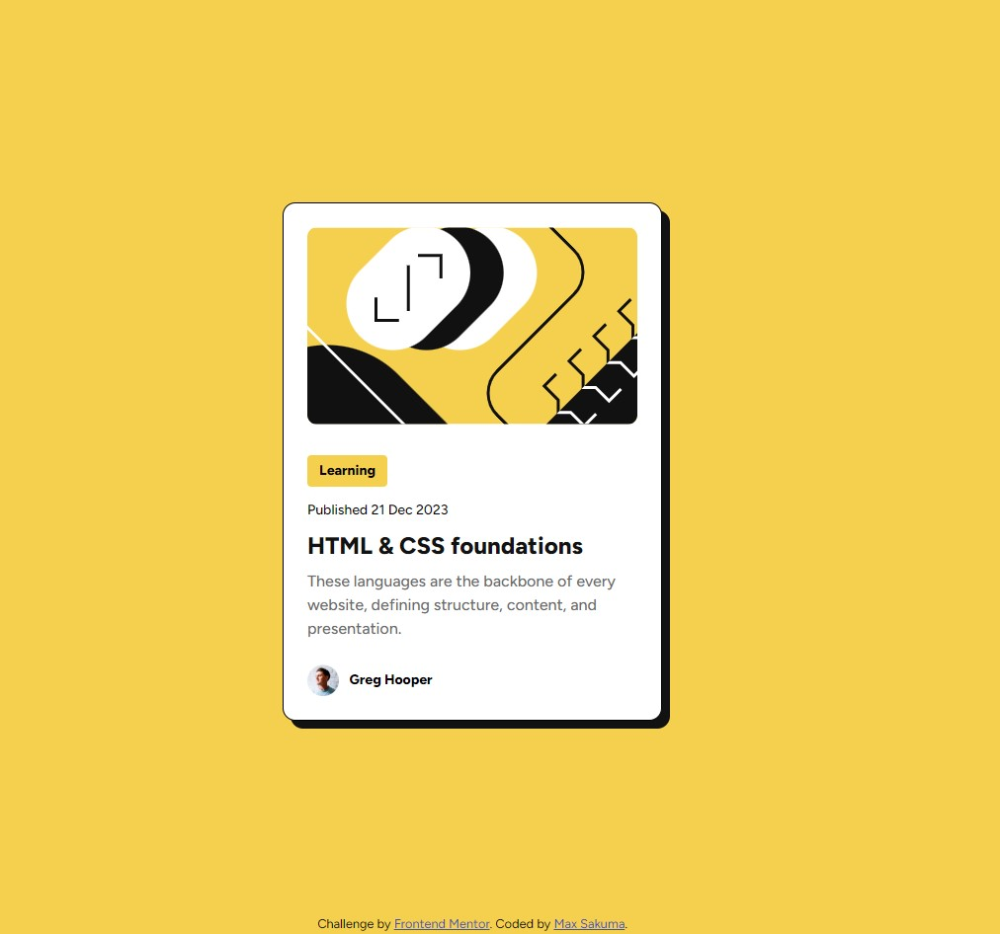

# Frontend Mentor - Blog preview card solution

This is a solution to the [Blog preview card challenge on Frontend Mentor](https://www.frontendmentor.io/challenges/blog-preview-card-ckPaj01IcS). Frontend Mentor challenges help you improve your coding skills by building realistic projects.

## Table of contents

- [Overview](#overview)
  - [The challenge](#the-challenge)
  - [Screenshot](#screenshot)
  - [Links](#links)
- [My process](#my-process)
  - [Built with](#built-with)
  - [What I learned](#what-i-learned)
  - [Continued development](#continued-development)
  - [Useful resources](#useful-resources)
- [Author](#author)
- [Acknowledgments](#acknowledgments)

## Overview

### The challenge

Users should be able to:

- See hover and focus states for all interactive elements on the page

### Screenshot

### Links

- Solution URL: [https://msakuma-dev.github.io/FrontendMentor-Blog-Preview-Card/](https://msakuma-dev.github.io/FrontendMentor-Blog-Preview-Card/)
- Live Site URL: [https://msakuma-dev.github.io/FrontendMentor-Blog-Preview-Card/](https://msakuma-dev.github.io/FrontendMentor-Blog-Preview-Card/)

## My process

### Built with

- Semantic HTML5 markup
- CSS custom properties
- Flexbox

### What I learned

I spent a lot more time to understand the design in the Figma files to get the text sizing correct.
I'm proud that I was able to understand how rem, em units work for font-sizes and how the padding and margins are at the proper size.

I also spent a good amount of time to make sure the media-queries are correct and the image resizes the way it's supposed to be.

### Continued development

I still want to understand how to apply the OG Meta Data correctly for these mini projects and make sure things are responsive the way I intend it to be.

### Useful resources

- [Control your images](https://youtu.be/6yAAV-uP0po?si=yLR3GglnMUsZWj-y) - This helped me to fit the image properly within the card. I really liked this pattern and will use it going forward.

## Author

- Frontend Mentor - [@msakuma-dev](https://www.frontendmentor.io/profile/msakuma-dev)

## Acknowledgments

Big thanks for @knjshimi for being a continuous mentor and friend.
@mkboris and @TedJenkler for giving very precious feedback on my first challenge. I've learn a lot from their resources and feedback.
